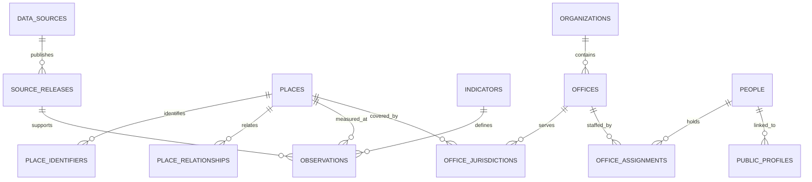

# Shared Pollmedia database design

## Implemented foundation

The clean Laravel application lives in `application/`. Its initial migration creates the following shared tables. SQLite supports the local page; these portable tables are intended to move to PostgreSQL. PostGIS is **not installed or tested yet**.

| Domain | Tables | Important distinction |
|---|---|---|
| Provenance | data_sources, source_releases | A publisher is separate from a dated/hash-identified release; raw and derived values retain lineage |
| Geography | places, place_identifiers, place_relationships | Permanent internal identity, versioned external identifiers, multiple typed relationships |
| Governance | organizations, offices, office_jurisdictions | Stable offices are separate from their jurisdiction and the people assigned to them |
| People | people, office_assignments, public_profiles | Current observations, effective tenure dates and biography links are separate |
| Development | indicators, observations | Definitions and units are separate from values for a place, period and release |

The source check date is not an appointment date. Unknown effective dates remain null. Superseding a directory observation changes the current display without rewriting history or inventing tenure dates. Officeholder replacement is a reviewed transaction; automated discovery/review is not yet connected.

### Integrity rules

- Source releases are unique per source/version. Identifiers are unique within their namespace and version, not across every source.
- Observations are unique per place, indicator, period and release. Null means missing, never zero.
- Evidence, offices and people referenced by dependent records use restrictive foreign keys rather than cascade deletion.
- Place relationships and office jurisdictions retain evidence and optional effective dates. Validate date ordering in write services; PostgreSQL constraints are a required production follow-up.
- Current directory cards use unsuperseded, non-ended assignments with matching jurisdiction. Acting/additional-charge cases need explicit review and cannot be silently collapsed into a singleton role.
- SQL ID order is used only for accepted, seeded prototype payloads. Production imports must explicitly activate releases after validation; insertion order is not a substitute for source observation time.

## Next domain migrations (designed, not created yet)

| Domain | Proposed entities / key fields | Required behavior |
|---|---|---|
| Spatial geography | boundary_versions(place_id, geometry, SRID, effective range, release_id); relation_reviews | PostGIS MultiPolygon with spatial index; preserve source projection, validate geometry and transform to map coordinates |
| Electoral history | elections(type, date, jurisdiction); constituency_editions(place_id, boundary_version); parties; candidacies(person_id, election_id, constituency_edition_id, party_id); results(candidacy_id, votes, release_id) | Preserve candidacy-time party; constituency counts/turnout have documented denominators; version final corrections |
| SIR | roll_editions(year, type, geography_version); documents(release_id, AC, part, language, pages); summary_values(document_id, measure, value, page) | Draft/final/supplements distinct; part number unique within AC/edition; access mode and permitted fields checked per source |
| Citizen issues | issue_categories; issues(reporter_id, category_id, description, lifecycle_state); issue_locations(geometry, confidence); issue_geographies(issue_id, place_id, boundary_version); evidence; supporters | One issue linked to several geographies; unique supporter per issue; moderation and access permissions precede publication |
| Responsibility | responsibility_rules(category, asset/service owner, jurisdiction, office); issue_routes(issue_id, office_id, valid range, reason) | Route to the stable office; preserve earlier assignments when staff change |
| Responses | grievance_references; responses(issue_id, author, office_id, assignment_id, timestamp); status_events; resolution_confirmations | Separate official disposal from citizen-confirmed resolution; append event history |
| Surveys | instruments/version; questions; survey_waves(period, target geography, sampling method); consented responses; published_aggregates(sample size, uncertainty) | Personal responses separate from public aggregates; no scores derived from complaint volume |
| Operations | import_runs; source_check_events; validation_findings; change_reviews; release_activations | Failure keeps accepted data; atomic activation; retries idempotent; track stale sources and source-specific refresh policies |

## Application modules

1. Geography and source registry provide identity/provenance to every module.
2. Development reads observations and exposes source links without assuming every geography has every indicator.
3. Governance resolves officeholders and profiles through stable offices.
4. Elections and SIR attach to electoral geography rather than district names.
5. Issues, routing and resolution reference shared places/offices; reporting workflows come after authentication/moderation design.
6. Surveys and comparisons use explicit methodology and compatible periods.

## Current interface and implementation limits

The integrated district/PC pages are server-rendered Blade views to validate content and relationships without adding a frontend build dependency. React/Inertia remains the planned interactive frontend; it is not configured yet. The original SIR interface is available inside Laravel using the same accepted aggregate sample, with Laravel API routes.

PostgreSQL service/client, PHP `pdo_pgsql`, PostGIS, automated authority sync, map validation, final election imports, issue submission and surveys remain pending. No full-platform completion or live current-officeholder guarantee is implied by the prototype.
